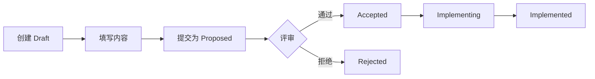

# RFC 体系总览

## 📁 目录结构

```
rfcs/
├── README.md              # RFC 流程说明
├── QUICK_START.md         # 5 分钟快速上手
├── CONTRIBUTING.md        # 贡献指南
├── INDEX.md               # RFC 索引（按状态分类）
├── template.md            # RFC 模板
├── .gitkeep               # 确保目录被 git 追踪
├── 2026/                  # 按年份组织的 RFC
│   └── RFC-2026-0001-backend-mcp-integration.md
└── assets/                # RFC 相关资源
    ├── diagrams/          # 架构图、流程图等
    └── examples/          # 示例代码片段
```

## 🚀 快速开始

### 创建新 RFC

```bash
# 方式 1: 使用脚本（推荐）
./scripts/create-rfc.sh

# 方式 2: 手动创建
cp rfcs/template.md rfcs/2026/RFC-2026-NNNN-title.md
```

### 查看现有 RFC

```bash
# 查看索引
cat rfcs/INDEX.md

# 查看特定 RFC
cat rfcs/2026/RFC-2026-0001-backend-mcp-integration.md
```

## 📋 RFC 编号规则

```
RFC-YYYY-NNNN-标题.md
```

- `YYYY`: 年份（4位）
- `NNNN`: 序号（4位，从 0001 开始）
- `标题`: 英文 kebab-case

**示例**:
- `RFC-2026-0001-backend-mcp-integration.md`
- `RFC-2026-0002-credit-system-v2.md`

## 📊 RFC 状态

| 状态 | 说明 | 文件位置 |
|---|---|---|
| Draft | 草稿阶段，正在讨论 | 任意位置 |
| Proposed | 已提出，等待评审 | 任意位置 |
| Accepted | 已接受，准备实施 | 任意位置 |
| Implementing | 实施中 | 任意位置 |
| Implemented | 已实施 | `2026/` 等年份目录 |
| Rejected | 已拒绝 | `2026/` 等年份目录 |
| Deprecated | 已废弃 | `2026/` 等年份目录 |
| Superseded | 已被新 RFC 取代 | `2026/` 等年份目录 |

## 🔄 工作流程



详细步骤：

1. **创建草稿**: 使用脚本或手动创建，状态为 `Draft`
2. **完善内容**: 按模板填写各章节
3. **提交评审**: 状态改为 `Proposed`，团队评审
4. **接受方案**: 评审通过，状态改为 `Accepted`
5. **开始实施**: 写代码，状态改为 `Implementing`
6. **完成实施**: 上线，状态改为 `Implemented`

## 📝 必须写 RFC 的场景

✅ **必须写**:
- 新增 CLI 命令（如 `arti portfolio`）
- 破坏性变更（修改命令行为、输出格式）
- 架构调整（数据源切换、模块重构）
- API 接口变更
- 计费模型调整

❌ **不需要写**:
- Bug 修复（不涉及架构）
- 文档更新
- 代码重构（不改变外部行为）
- 依赖升级（无破坏性）

## 📚 文档清单

| 文档 | 用途 | 目标读者 |
|---|---|---|
| [README.md](README.md) | RFC 流程说明 | 所有人 |
| [QUICK_START.md](QUICK_START.md) | 5 分钟上手 | 新手 |
| [CONTRIBUTING.md](CONTRIBUTING.md) | 贡献指南 | 贡献者 |
| [INDEX.md](INDEX.md) | RFC 索引 | 查找 RFC |
| [template.md](template.md) | RFC 模板 | 创建 RFC |

## 🛠️ 辅助工具

### 创建 RFC 脚本

```bash
./scripts/create-rfc.sh
```

功能：
- 自动生成下一个 RFC 编号
- 从模板创建新 RFC
- 自动更新 INDEX.md
- 预填充元数据（日期、作者等）

### 手动更新 INDEX.md

当 RFC 状态变化时，需要手动更新 `INDEX.md`：

1. 从旧状态部分移除条目
2. 添加到新状态部分
3. 更新统计数字

## 💡 最佳实践

### 1. 摘要要简洁

❌ 差的摘要:
> 这个 RFC 讨论了关于组合管理的一些想法。

✅ 好的摘要:
> 添加 `arti portfolio` 命令，支持投资组合管理、收益计算和风险分析。

### 2. 动机要充分

说清楚：
- 当前有什么问题？
- 为什么现在要解决？
- 不做会有什么后果？

### 3. 设计要详细

包含：
- 架构图
- 数据结构定义
- API 变更清单
- 实现计划
- 测试策略

### 4. 权衡要全面

对比至少 2-3 个方案，说明：
- 每个方案的优缺点
- 为什么选择当前方案
- 为什么不选其他方案

## 📈 统计信息

| 指标 | 数值 |
|---|---|
| 总 RFC 数 | 1 |
| Implemented | 1 |
| Implementing | 0 |
| Accepted | 0 |
| Proposed | 0 |
| Draft | 0 |

**最后更新**: 2026-05-19

## 🔗 相关链接

- [Rust RFC Process](https://github.com/rust-lang/rfcs)
- [Python PEP](https://peps.python.org/)
- [Kubernetes KEP](https://github.com/kubernetes/enhancements)
